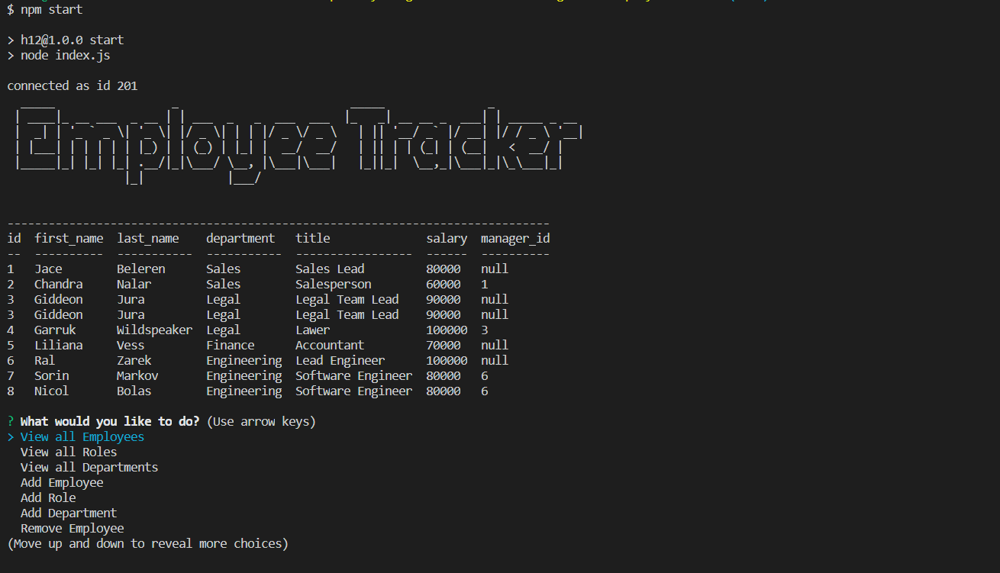

# Employee Tracker 

## Table of Contents

- [Project Title](#project-title)
- [Description](#description)
- [Table of contents](#table-of-contents)
- [Installation Instructions](#installation)
- [Contributions](#contribute)
- [Questions](#questions)
- [Tests](#tests)
- [License](#license)

## Description 

 This is a node terminal application that allows you to edit your employee database using SQL. By displaying a list of questions to the user, they are able to edit existing employees, add new employees, roles and departments, and remove existing employees as well. This is all encompassed by a slick terminal interface that displays the list of employees directly to the terminal without need of MySQL workbench.   

 This image shows the relation of our tables database below

  
This image below is an example of our command line application

   
Watch the video below for a walkthrough!
https://drive.google.com/file/d/16KY-ZpCc4Yr_2ZaSb1WDwbwmKRr6UwHR/view

## Installation Instructions 

 To install and get the program up an running, clone the repo to your local machine. Then run 'npm i' in the terminal to install the necessary packages. You will have a base seed of employees to work with starting out, so to bring up the inquirer prompt, type 'npm start' command into the terminal to get started. Don't forget you will also need a .env with your MySQL password. Then you should be good to go., 

## Contributions 

 Calvin Jacobsen 

## Questions 

 You can ask your questions by messaging me on Github at -> https://github.com/CalvinJacobsen   or by emailing me at -> Jaco1932@umn.edu

## Tests 

 npm start <- to start prompts 

 [(Back to top)](#table-of-contents)